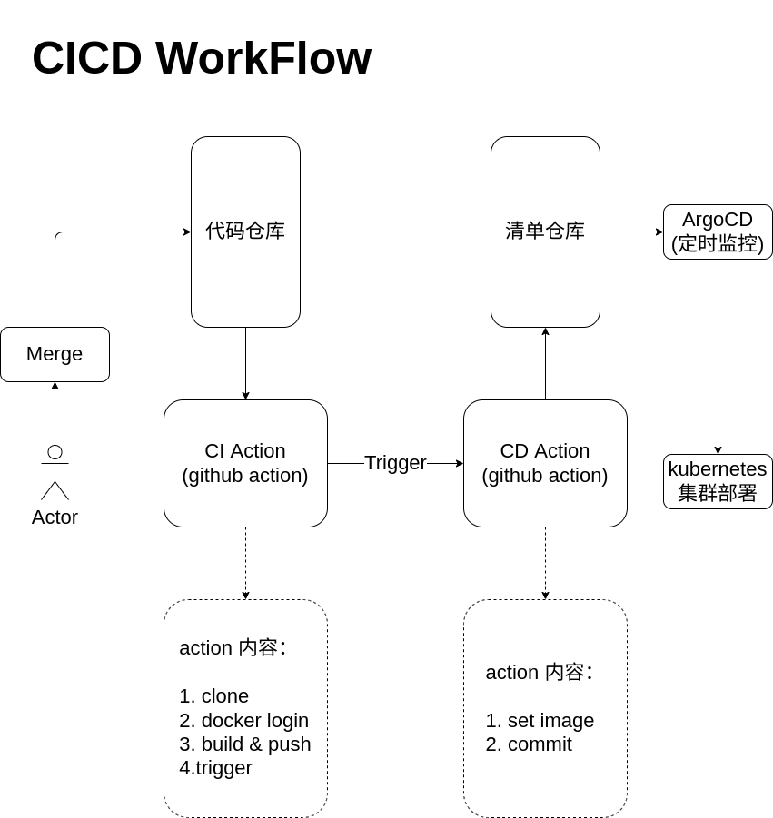

# ArgoCD 系列测试
argocd 的 环境搭建 安装 使用
对照视频 https://www.bilibili.com/video/BV17F411h7Zh?p=3

## 环境搭建
为防止网络访问问题 使用 云服务商的 HK 单节点机器测试
保留配置文件到本地便于快速再次启动

1. 测试host: `hk-t1`(ubuntu2204)
2. [kubekey](https://github.com/kubesphere/kubekey)
3. [k9s](https://github.com/derailed/k9s)
4. openelb 4th层网络 [openelb](https://github.com/openelb/openelb)
5. [nginx-ingress](https://github.com/kubernetes/ingress-nginx)
6. 修改 `ingress-nginx-controller` svc [从 openelb 获取 ip](https://openelb.io/docs/getting-started/usage/use-openelb-in-layer-2-mode/)
    添加配置:
    ```
    metadata:
      annotations:
        lb.kubesphere.io/v1alpha1: openelb
        protocol.openelb.kubesphere.io/v1alpha1: layer2
    ```
7. [helm](https://helm.sh/)
8. [openebs](https://github.com/openebs/openebs)
    验证 openebs [local-pv-hostpath](https://openebs.io/docs/user-guides/localpv-hostpath)
    验证 pvc 状态是否正常

#### 命令记录
```console
apt update
mkdir -p tool
cd tool

## 本地下载安装 kubectl (kubekey 会在新环境安装 kubectl)
curl -LO "https://dl.k8s.io/release/$(curl -L -s https://dl.k8s.io/release/stable.txt)/bin/linux/amd64/kubectl"
install -o root -g root -m 0755 kubectl /usr/local/bin/kubectl
### kubectl 自动补全
apt install -y bash-completion
echo "source <(kubectl completion bash)" >> ~/.bashrc
echo alias k='kubectl' >> ~/.bashrc
source ~/.bashrc

## 下载安装 kubekey
wget https://github.com/kubesphere/kubekey/releases/download/v3.0.7/kubekey-v3.0.7-linux-amd64.tar.gz
tar -zxvf kubekey-v3.0.7-linux-amd64.tar.gz
mv kk /usr/local/bin/

## 下载安装 k9s
wget https://github.com/derailed/k9s/releases/download/v0.27.0/k9s_Linux_amd64.tar.gz
tar -zxvf k9s_Linux_amd64.tar.gz
mv k9s /usr/local/bin/

## 搭建单节点 kubernetes [all-in-one-on-linux](https://kubesphere.io/docs/v3.3/quick-start/all-in-one-on-linux/) 执行两次第二次才成功?
apt install -y socat conntrack ebtables ipset
kk create cluster --with-kubernetes v1.24.0 --container-manager containerd 

## 使 pods 能在 master 上运行需要删除 node 上的 taint
### 查看 taint
kubectl get nodes -o=custom-columns=NodeName:.metadata.name,TaintKey:.spec.taints[*].key,TaintValue:.spec.taints[*].value,TaintEffect:.spec.taints[*].effect
### 移除 taint
kubectl taint node --all node-role.kubernetes.io/master:NoSchedule-
kubectl taint node --all node-role.kubernetes.io/control-plane:NoSchedule-

## 安装 [openelb](https://openelb.io/docs/getting-started/installation/install-openelb-on-kubernetes/)
kubectl apply -f https://raw.githubusercontent.com/openelb/openelb/master/deploy/openelb.yaml
### 配置 [eip](config/openelb/eip.yaml)

## 安装 [nginx-ingress](https://kubernetes.github.io/ingress-nginx/deploy/)
kubectl apply -f https://raw.githubusercontent.com/kubernetes/ingress-nginx/controller-v1.5.1/deploy/static/provider/cloud/deploy.yaml
### 修改 svc ingress-nginx-controller 添加 annotation
kubectl -n ingress-nginx edit svc ingress-nginx-controller

## 安装 [helm](https://helm.sh/docs/intro/install/)
curl https://raw.githubusercontent.com/helm/helm/main/scripts/get-helm-3 | bash
helm version

## 安装 [openebs](https://github.com/openebs/openebs#installation-and-getting-started)
helm repo add openebs https://openebs.github.io/charts
helm repo update
helm install openebs openebs/openebs --create-namespace --namespace openebs
### 验证 openebs [local-pv-hostpath](https://openebs.io/docs/user-guides/localpv-hostpath)
kubectl apply -f https://openebs.github.io/charts/examples/local-hostpath/local-hostpath-pvc.yaml
kubectl apply -f https://openebs.github.io/charts/examples/local-hostpath/local-hostpath-pod.yaml
kubectl get pvc -A
### 验证成功结束 删除
kubectl delete -f https://openebs.github.io/charts/examples/local-hostpath/local-hostpath-pvc.yaml
kubectl delete -f https://openebs.github.io/charts/examples/local-hostpath/local-hostpath-pod.yaml
```

## argocd 安装部署
这里使用官方配置清单安装(还有helm的安装方式)
1. [安装文档](https://argo-cd.readthedocs.io/en/stable/getting_started/)
2. [nginx-ingress](https://argo-cd.readthedocs.io/en/stable/operator-manual/ingress/#kubernetesingress-nginx)
3. 但是由于 nginx-ingress 在 `kube-all-on-one-linux` 中 所以如果想要暴露到公网 可以使用 nginx 代理(直接运行在 hk-t1 上) [nginx配置](config/nginx/nginx.conf)
4. 获取 argocd 密码(用户名: admin)
    `kubectl -n argocd get secret argocd-initial-admin-secret -o jsonpath="{.data.password}" | base64 -d`


#### 命令记录
```console
## argocd 安装
kubectl create namespace argocd
kubectl apply -n argocd -f https://raw.githubusercontent.com/argoproj/argo-cd/stable/manifests/install.yaml

## 为 argocd 配置 [nginx-ingress](config/argocd/argocd-nginx-ingress.yaml)

## 为 argocd 配置 nginx 便于外网访问
apt install nginx
vim /etc/nginx/nginx.conf

## 获取 argocd 密码
kubectl -n argocd get secret argocd-initial-admin-secret -o jsonpath="{.data.password}" | base64 -d
### admin/`password` 登录后页面操作
```

## 尝试跑起一个 demo 应用 
1. [doc](https://argo-cd.readthedocs.io/en/stable/getting_started/#6-create-an-application-from-a-git-repository)
2. [demo](https://github.com/argoproj/argocd-example-apps)
    - guestbook application (第一次 outofsynced 启动2次成功)

## 尝试创建一个应用(使用 Github-Action)


Note:
    1. 为在代码中不暴露 dockerhub 的 username/password 以及 github-token，需要以 secret 的形式存储在源码仓库中